<div align="center">

# 🎮 College Fun Games
### Interactive Scavenger Hunt Platform

[](https://college-fun-games.vercel.app)
[](https://reactjs.org/)
[](https://supabase.com/)
[](https://vercel.com/)

<p align="center">
  
</p>

**Scan to Play** • [Live Demo](https://college-fun-games.vercel.app)

---

</div>

## 📖 Overview

An engaging web-based scavenger hunt game developed for College Sport Week IT Club Challenge. Players navigate through five progressive levels, solving puzzles and discovering physical locations around campus using location-based clues. Features real-time progress tracking, secure authentication, and a competitive leaderboard system.

### ✨ Key Highlights

- 🔐 **Secure Authentication** - Google OAuth 2.0 integration via Supabase
- 💾 **Persistent Progress** - Real-time database synchronization
- 🎯 **Multi-Level Gameplay** - 5 challenging levels with unique mechanics
- 🗺️ **Location-Based Unlocks** - Physical scavenger hunt elements
- 📊 **Live Leaderboard** - Participant ranking and progress tracking
- 📱 **Fully Responsive** - Optimized for mobile, tablet, and desktop
- ⚡ **Fast Performance** - Built with modern React and deployed on Vercel Edge Network

## 🎮 Game Flow


```mermaid
graph LR
    A[Login] --> B[Home/Dashboard]
    B --> C[Level 1]
    C --> D[Unlock 1: Cafeteria]
    D --> E[Level 2]
    E --> F[Unlock 2: Library]
    F --> G[Level 3]
    G --> H[Unlock 3: Entrance]
    H --> I[Level 4]
    I --> J[Unlock 4: Hot Water]
    J --> K[Level 5]
    K --> L[Final Results]
```

### Level Breakdown

| Level | Type | Challenge | Unlock Clue |
|-------|------|-----------|-------------|
| **1** | Puzzle | Introduction challenge | *"Where empty stomachs find peace..."* (Cafeteria) |
| **2** | Puzzle | Intermediate difficulty | *"Filled with books from floor to ceiling..."* (Library) |
| **3** | Puzzle | Advanced challenge | *"First thing you see arriving, last passing..."* (Entrance) |
| **4** | Puzzle | Expert level | *"Always hot but never angry..."* (Hot Water Station) |
| **5** | Puzzle | Final challenge | — |
| **Final** | Results | Leaderboard & completion | — |

## 🛠️ Tech Stack

### Frontend
- **React 19** - UI framework
- **React Router DOM** - Client-side routing
- **CSS3** - Custom styling

### Backend & Database
- **Supabase** - PostgreSQL database with real-time subscriptions
- **Supabase Auth** - Authentication & user management
- **Google OAuth 2.0** - Third-party authentication provider

### Deployment & DevOps
- **Vercel** - Serverless deployment platform
- **Git/GitHub** - Version control
- **npm** - Package management

## 🚀 Quick Start

### Prerequisites

Ensure you have the following installed:
- Node.js (v16 or higher)
- npm (v8 or higher)
- Git

### Installation

1. **Clone the repository**
```bash
   git clone https://github.com/Boredoom17/college-fun-games.git
   cd college-fun-games
```

2. **Install dependencies**
```bash
   npm install --legacy-peer-deps
```

3. **Configure environment variables**
   
   Create a `.env` file in the root directory:
```env
   REACT_APP_SUPABASE_URL=your_supabase_project_url
   REACT_APP_SUPABASE_ANON_KEY=your_supabase_anon_key
```

4. **Start development server**
```bash
   npm start
```
   
   The app will be available at `http://localhost:3000`

## 🗄️ Database Architecture

### Participants Table Schema
```sql
CREATE TABLE participants (
  id UUID PRIMARY KEY DEFAULT uuid_generate_v4(),
  user_email TEXT UNIQUE NOT NULL,
  participant_number INTEGER UNIQUE,
  current_level INTEGER DEFAULT 1,
  completed_levels JSONB DEFAULT '[]'::jsonb,
  created_at TIMESTAMP WITH TIME ZONE DEFAULT NOW()
);

-- Indexes for performance
CREATE INDEX idx_participants_email ON participants(user_email);
CREATE INDEX idx_participants_number ON participants(participant_number);
```

### Key Functions

- `getOrCreateUser(email)` - Retrieves or creates participant record
- `updateUserProgress(email, level)` - Updates current level
- `completeLevel(email, level)` - Marks level as completed
- `assignParticipantNumber(email)` - Assigns unique participant ID

## ⚙️ Configuration

### Supabase Setup

1. Create a new Supabase project at [supabase.com](https://supabase.com)
2. Navigate to **SQL Editor** and create the participants table (see schema above)
3. Go to **Authentication → Providers** and enable Google OAuth
4. Add your Google Client ID and Client Secret
5. Configure redirect URLs:
   - `https://your-domain.vercel.app/**`
   - `http://localhost:3000/**`

### Google Cloud Console Setup

1. Go to [Google Cloud Console](https://console.cloud.google.com/)
2. Create a new project or select existing
3. Navigate to **APIs & Services → Credentials**
4. Create **OAuth 2.0 Client ID**
5. Configure **Authorized JavaScript origins**:
   - `https://your-domain.vercel.app`
   - `https://your-supabase-url.supabase.co`
6. Configure **Authorized redirect URIs**:
   - `https://your-domain.vercel.app`
   - `https://your-supabase-url.supabase.co/auth/v1/callback`

## 🚢 Deployment

### Deploy to Vercel

1. **Install Vercel CLI**
```bash
   npm i -g vercel
```

2. **Login to Vercel**
```bash
   vercel login
```

3. **Deploy to production**
```bash
   vercel --prod
```

4. **Add environment variables**
```bash
   vercel env add REACT_APP_SUPABASE_URL
   vercel env add REACT_APP_SUPABASE_ANON_KEY
```
   
   Select all environments (Production, Preview, Development)

### Continuous Deployment

Push to the `main` branch to trigger automatic deployments:
```bash
git add .
git commit -m "Your commit message"
git push origin main
```

## 📱 QR Code Distribution

### Generating Custom QR Codes

For physical event distribution, generate QR codes with:
- **URL**: `https://college-fun-games.vercel.app`
- **Size**: Minimum 300×300px (recommend 500×500px for print)
- **Format**: PNG for digital, SVG for scalable print
- **Error Correction**: Level H (High) - 30% recovery

**Recommended Tools:**
- [QR Code Generator](https://www.qr-code-generator.com/)
- [QR Code Monkey](https://www.qrcode-monkey.com/)
- CLI: `qrencode -o qrcode.png "https://college-fun-games.vercel.app"`

## 🎯 Usage Guide

### For Players

1. **Access the Game**
   - Scan the QR code or visit the URL
   - Sign in with your Google account

2. **Navigate the Dashboard**
   - View your current level and progress
   - Check completed levels (green checkmarks)
   - See your participant number

3. **Complete Levels**
   - Read the challenge carefully
   - Solve the puzzle to progress
   - Enter the unlock word to access the next level

4. **Find Physical Locations**
   - Read the location clue
   - Visit the actual location on campus
   - Enter the location-specific unlock word

5. **Track Your Progress**
   - View the final leaderboard upon completion
   - Compare your performance with other participants

### For Administrators

- Access Supabase dashboard to view all participants
- Monitor progress in real-time
- Export data for analysis
- Modify level content by updating component files

## 📊 Project Structure
```
college-fun-games/
├── public/
│   ├── index.html
│   └── manifest.json
├── src/
│   ├── components/
│   │   ├── Login.js          # Google OAuth login
│   │   ├── Home.js            # Dashboard/home page
│   │   ├── Level1.js          # Game level 1
│   │   ├── Level2.js          # Game level 2
│   │   ├── Level3.js          # Game level 3
│   │   ├── Level4.js          # Game level 4
│   │   ├── Level5.js          # Game level 5
│   │   ├── UnlockPage.js      # Location unlock page
│   │   └── FinalPage.js       # Results/leaderboard
│   ├── utils/
│   │   └── supabase.js        # Supabase client & helpers
│   ├── App.js                 # Main app component
│   ├── styles.css             # Global styles
│   └── index.js               # Entry point
├── .env                       # Environment variables (gitignored)
├── .gitignore
├── .npmrc                     # npm configuration
├── package.json
├── README.md
└── qrcode.png                 # QR code for sharing
```

## 🔒 Security

- ✅ Environment variables stored securely in Vercel
- ✅ Supabase Row Level Security (RLS) enabled
- ✅ OAuth 2.0 authentication flow
- ✅ HTTPS enforcement on production
- ✅ No sensitive credentials in client code
- ✅ API keys are anonymous/public keys only

**Note:** The Supabase anon key is safe to expose publicly. Database security is enforced through RLS policies.

## 🤝 Contributing

Contributions are welcome! To contribute:

1. Fork the repository
2. Create a feature branch
```bash
   git checkout -b feature/amazing-feature
```
3. Commit your changes
```bash
   git commit -m "Add amazing feature"
```
4. Push to your branch
```bash
   git push origin feature/amazing-feature
```
5. Open a Pull Request


## 🐛 Known Issues

- None currently reported

Found a bug? [Open an issue](https://github.com/Boredoom17/college-fun-games/issues)

## 📈 Future Enhancements

- [ ] Timer-based challenges
- [ ] Team mode support
- [ ] Admin dashboard for live monitoring
- [ ] Dynamic level generation
- [ ] Achievement system
- [ ] Mobile app version (React Native)
- [ ] Multilingual support
- [ ] Photo upload verification for locations
- [ ] Real-time multiplayer features

## 📄 License

This project is created for educational purposes as part of the College Sport Week IT Club Challenge.

**MIT License** - feel free to use this code for learning and educational purposes.

## 👨‍💻 Author

**Aadarsha Chhetri**
- GitHub: [@Boredoom17](https://github.com/Boredoom17)
- Project Link: [https://github.com/Boredoom17/college-fun-games](https://github.com/Boredoom17/college-fun-games)

## 🙏 Acknowledgments

- **College IT Club** - Event organization and support
- **Supabase Team** - Excellent database and auth platform
- **Vercel** - Lightning-fast deployment infrastructure
- **React Community** - Comprehensive documentation and support
- **Google Cloud** - OAuth authentication services
- **All Participants** - Making this event a success!

## 📞 Support

Need help? Here's how to get support:

- 📧 Open an [issue](https://github.com/Boredoom17/college-fun-games/issues)
- 📖 Check the [documentation](https://github.com/Boredoom17/college-fun-games#readme)
- 💬 Reach out on GitHub Discussions

---

<div align="center">

**⭐ Star this repo if you found it helpful!**

Made with ❤️ for College Sport Week 2026

[🎮 Play Now](https://college-fun-games.vercel.app) • [📝 Report Bug](https://github.com/Boredoom17/college-fun-games/issues) • [✨ Request Feature](https://github.com/Boredoom17/college-fun-games/issues)

</div>
